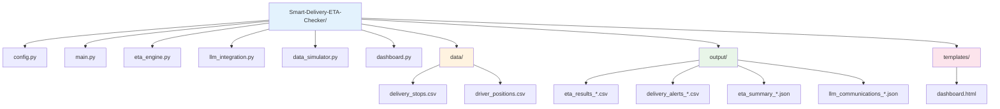

# Smart Delivery ETA Checker

A comprehensive delivery tracking and ETA prediction system with AI-powered communications and real-time monitoring dashboard.

## System Architecture


## Data Flow Process


## Component Relationships


## File Structure



## Quick Start

1. **Install Dependencies**
   ```bash
   pip install -r requirements.txt
   ```

2. **Set up Environment**
   ```bash
   cp .env.example .env
   # Add your OpenAI API key to .env
   ```

3. **Run Simulation**
   ```bash
   python demo_realistic_delays.py
   ```

4. **Start Dashboard**
   ```bash
   python dashboard.py
   ```

5. **View Results**
   - Dashboard: http://localhost:8000
   - Output files in `/output` directory

## Features

- 🚚 **Real-time ETA Calculation**
- 🚨 **Intelligent Delay Detection**
- 🤖 **AI-Powered Communications**
- 📊 **Professional Dashboard**
- 📈 **Performance Analytics**
- 📱 **Responsive Design**

## API Endpoints

- `GET /` - Dashboard interface
- `GET /api/dashboard-data` - Current data
- `GET /api/run-simulation` - Trigger simulation
- `GET /api/driver/{driver_id}` - Driver details

## Technology Stack

- **Backend**: Python, FastAPI
- **AI**: OpenAI GPT
- **Frontend**: HTML5, Tailwind CSS, Chart.js
- **Data**: Pandas, NumPy
- **Visualization**: Mermaid, Chart.js